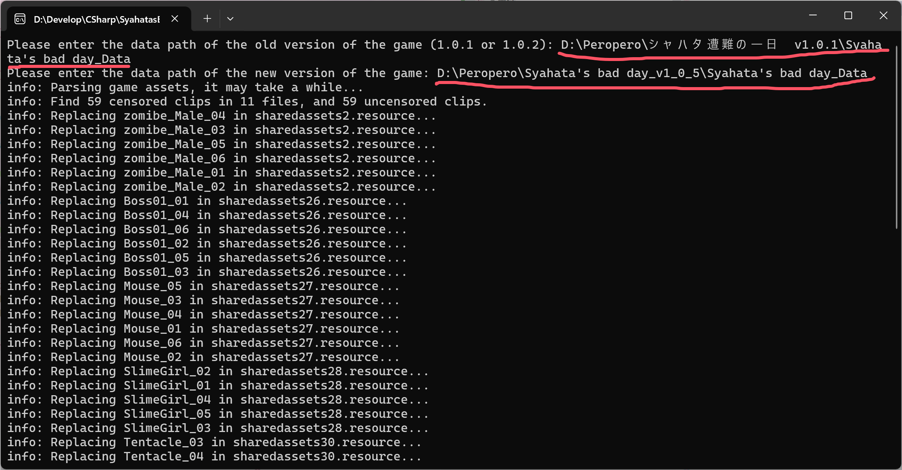

~~[English(Unfinished)](README_EN.md)~~ ~~[日本語(Unfinished)](README_EN.md)~~

Welcome translate pull request

# Syahata's Bay Day Uncensored Port

此程序用于将游戏 `沙哈塔的遇难日` 中老版本的未经审查的CG移动到新版本的资源文件中

## 使用方法

1. 打开本项目的 [Release](https://github.com/dogdie233/SyahatasBadDayUncensoredPort/releases) 页面，选择最新的版本并下载，其中文件名包含 `self-contained` 的版本 __包含了__ 运行程序所需要的环境，如果你已经有了`.net 8`运行环境，则可以下载 __不带__ `self-contained` 的版本

2. 双击exe启动程序，按照提示输入游戏路径，第一行输入 __老版本__ 的路径，第二行输入 __新版本__ 的路径
   

   > [!IMPORTANT]
   > 是游戏的 __数据文件目录__ 而不是 __可执行文件目录__  
   > __数据文件目录__ 是可执行文件(`.exe`)路径中的以`_Data`结尾的文件夹  
   > 一般为 __Syahata's bad day_Data__

3. 如果程序正常运行完成，则会输出 __All done! Press any key to exit.__ 如果程序在运行过程中窗口直接关闭，则表示运行错误，建议在本程序位置打开cmd后通过cmd运行，将错误信息发送至 `github issue`

4. 启动游戏，接下来的所有CG应该都是未经审查的（不存在于老版本的CG除外）
   
## 其他内容

> [!WARNING]
> 请不要反复运行此程序，会导致你的游戏资源越来越大  
> 程序每次运行都会将未经审查的CG直接追加到新版本的资源文件中

### 安卓版怎么办

由于我很懒，而且也没有安卓端的apk，所以只提出一些关键步骤

1. 将apk解压
2. 使用 __<解压路径>/assets/bin/Data/__ 作为新版本的游戏路径执行程序
3. 将 __<解压路径>/assets/bin/Data/__ 中被处理完毕的资源包重新封入apk并签名
